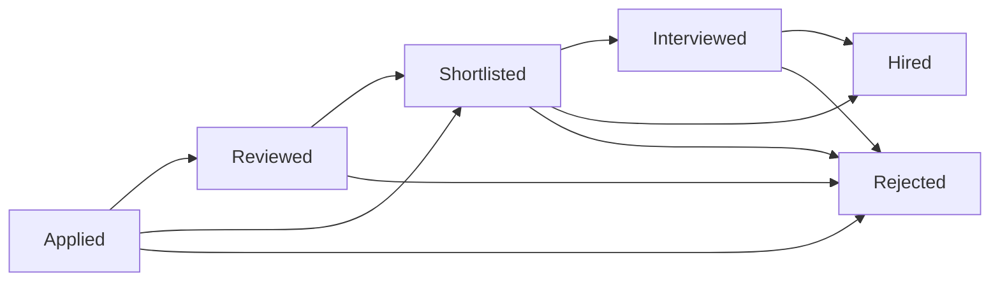

# Employer Job Posting & Application Management System

## 📋 Overview

The PTimeBuddy platform provides employers with a comprehensive job posting and application management system. This guide covers all features, workflows, and technical implementation details for the employer-side functionality.

## 🎯 Core Features

### 1. Job Post Management
- **Create Job Posts**: Full-featured job posting with business integration
- **Draft/Published/Closed Status**: Complete lifecycle management
- **Business Association**: Link jobs to specific business locations
- **Real-time Updates**: Instant status changes and modifications

### 2. Application Tracking System
- **Three-Tab Workflow**: Post Tracking → Shortlisted → Hired
- **Smart Filtering**: Only relevant jobs appear in each tab
- **Action Buttons**: One-click shortlisting and hiring
- **Status Management**: Automatic application status transitions

### 3. Business Integration
- **Multi-Business Support**: Manage jobs across multiple business locations
- **Business Tile View**: Visual organization by business
- **Location-Based Filtering**: Filter jobs by specific business locations
- **Statistics Dashboard**: Real-time metrics per business

## 🔄 Application Workflow

### Tab-Based Organization

#### 📊 **Post Tracking Tab**
**Purpose**: Primary job management and new application processing

**What Shows Here**:
- ✅ ALL job posts created by the employer
- ✅ Applications with status: `applied` and `reviewed`
- ✅ Action buttons: Shortlist ✅ and Hire 🟩

**Key Features**:
- Business tile view for organization
- Job post status management (Draft/Published/Closed)
- Resume preview with action buttons
- Application filtering and management

#### 📥 **Shortlisted Tab**
**Purpose**: Focus on candidates under consideration

**What Shows Here**:
- ✅ ONLY jobs that have shortlisted or interviewed applications
- ✅ Applications with status: `shortlisted` and `interviewed`
- ✅ Action buttons: Hire 🟩 (shortlist button hidden)

**Key Features**:
- Clean, focused view of active candidates
- Business grouping for shortlisted applications
- Interview scheduling and management
- Candidate comparison tools

#### ✅ **Hired Tab**
**Purpose**: Manage hired employees and closed positions

**What Shows Here**:
- ✅ ONLY jobs that have hired applications
- ✅ Applications with status: `hired`
- ✅ No action buttons (final status reached)

**Key Features**:
- Employee onboarding tracking
- Closed job post management
- Hiring statistics and reports
- Integration with employee management

## 🎨 User Interface Components

### Business Tile View
```
┌─────────────────────────────────┐
│ 🍽️ Restaurant Name              │
│ Fast Food Restaurant            │
│ ────────────────────────────────│
│ 📍 New York, NY                │
│                                 │
│    5        12                  │
│ Job Posts  Applications         │
│                                 │
│ Draft: 1  Published: 3  Closed: 1│
│                                 │
│ Click to view jobs →            │
└─────────────────────────────────┘
```

### Job Post Card
```
┌─────────────────────────────────────────────┐
│ Server Position [Published] [Shortlisted]  │
│ 🏢 Restaurant Name  📍 Location  💼 Part-Time│
│ ─────────────────────────────────────────── │
│ 💰 $15-18/hr  ⏰ 25h/week  📅 Flexible     │
│                                             │
│ 🔵 Health Insurance  🟢 Tips               │
│                                             │
│ Job description preview...                  │
│                                             │
│ Applications (3) ▼                          │
│ └─ [Expanded application list]              │
└─────────────────────────────────────────────┘
```

### Application Card
```
┌─────────────────────────────────────────────┐
│ 👤 John Smith        [Shortlisted] ✕       │
│ 📅 Applied 2 days ago  📍 New York, NY     │
│ ─────────────────────────────────────────── │
│ ✉️ john@email.com    📞 (555) 123-4567     │
│                                             │
│ 🎯 Availability: Weekends                  │
│ 🚗 Transportation: Own Car                 │
│                                             │
│ 💼 Skills: [Customer Service] [POS]        │
│ 🗣️ Languages: [English] [Spanish]          │
│                                             │
│ 👤 About: Experienced server with...       │
│ 💬 Cover: "I'm excited to join..."         │
│                                             │
│ 📄 John Smith's Resume                      │
│ PDF • Click to view                    👁️   │
│                                             │
│ [Shortlist ✅]  [Hire 🟩]                  │
└─────────────────────────────────────────────┘
```

## 🔧 Technical Implementation

### Backend Architecture

#### API Endpoints

**Job Management**:
```
POST   /jobs                    - Create job post
GET    /jobs                    - Get all jobs (with filters)
GET    /jobs/with-applications  - Get jobs with specific application statuses
GET    /jobs/:id                - Get specific job
PATCH  /jobs/:id                - Update job post
DELETE /jobs/:id                - Delete job post
GET    /jobs/stats              - Get job statistics
GET    /jobs/businesses         - Get employer businesses
```

**Application Management**:
```
GET    /job-applications                - Get all applications
GET    /job-applications/job/:jobPostId - Get applications for job
PATCH  /job-applications/:id           - Update application status
```

#### Database Schema

**Job Posts Table** (`job_posts`):
```sql
- id: UUID (Primary Key)
- business_id: UUID (Foreign Key → businesses)
- employer_id: UUID (Foreign Key → profiles)
- job_title: TEXT
- job_type: TEXT (full-time/part-time)
- status: TEXT (draft/published/closed)
- business_name: TEXT
- location: TEXT
- pay_type: TEXT (hourly/salary)
- pay_min: NUMERIC
- pay_max: NUMERIC
- job_description: TEXT
- created_at: TIMESTAMPTZ
- published_at: TIMESTAMPTZ
- closed_at: TIMESTAMPTZ
```

**Applications Table** (`employee_job_application`):
```sql
- id: UUID (Primary Key)
- job_post_id: UUID (Foreign Key → job_posts)
- employee_id: UUID (Foreign Key → profiles)
- status: TEXT (applied/reviewed/shortlisted/interviewed/hired/rejected)
- full_name: TEXT
- email: TEXT
- phone: TEXT
- resume_url: TEXT
- applied_at: TIMESTAMPTZ
- status_updated_at: TIMESTAMPTZ
```

### Frontend Architecture

#### Component Structure
```
JobManagement.tsx
├── CreateJobPost.tsx
├── PostTracking.tsx
│   ├── BusinessTileView.tsx
│   └── ApplicationsList.tsx
├── Shortlisted.tsx
│   ├── ShortlistedBusinessTileView.tsx
│   └── ApplicationsList.tsx (filtered)
└── Hired.tsx
    ├── HiredBusinessTileView.tsx
    └── ApplicationsList.tsx (hired only)
```

#### State Management
```typescript
// Tab filtering logic
const [activeTab, setActiveTab] = useState<'create' | 'tracking' | 'shortlisted' | 'hired'>('create');

// Job filtering by application status
const loadJobs = async () => {
  if (tab === 'shortlisted') {
    return getJobsWithApplicationStatus(['shortlisted', 'interviewed']);
  } else if (tab === 'hired') {
    return getJobsWithApplicationStatus(['hired']);
  } else {
    return getJobPosts(); // All jobs for Post Tracking
  }
};
```

#### API Integration
```typescript
// Enhanced job fetching with application status filtering
export async function getJobsWithApplicationStatus(
  applicationStatuses: string[], 
  businessId?: string
): Promise<JobPost[]> {
  const params = new URLSearchParams();
  applicationStatuses.forEach(status => params.append('application_status', status));
  if (businessId) params.append('business_id', businessId);
  
  const response = await fetch(`${API_BASE_URL}/jobs/with-applications?${params.toString()}`);
  return response.json();
}
```

## 📊 Business Logic

### Smart Tab Filtering

#### Post Tracking Logic
```typescript
// Shows ALL jobs, filters applications to applied/reviewed
<ApplicationsList 
  jobPostId={job.id} 
  jobTitle={job.job_title}
  statusFilter={['applied', 'reviewed']}
  showActionButtons={true}
/>
```

#### Shortlisted Logic
```typescript
// Shows ONLY jobs with shortlisted/interviewed applications
const jobsWithShortlisted = await getJobsWithApplicationStatus(['shortlisted', 'interviewed']);

<ApplicationsList 
  jobPostId={job.id} 
  jobTitle={job.job_title}
  statusFilter={['shortlisted', 'interviewed']}
  showActionButtons={true}
/>
```

#### Hired Logic
```typescript
// Shows ONLY jobs with hired applications
const jobsWithHired = await getJobsWithApplicationStatus(['hired']);

<ApplicationsList 
  jobPostId={job.id} 
  jobTitle={job.job_title}
  statusFilter={['hired']}
  showActionButtons={false}
/>
```

### Application Status Transitions



### Action Button Logic
```typescript
// Shortlist Button - Only show if not already shortlisted/interviewed/hired
{!['shortlisted', 'interviewed', 'hired'].includes(application.status) && (
  <button onClick={() => handleStatusUpdate(application.id, 'shortlisted')}>
    Shortlist ✅
  </button>
)}

// Hire Button - Show for all statuses except hired
{application.status !== 'hired' && (
  <button onClick={() => handleStatusUpdate(application.id, 'hired')}>
    Hire 🟩
  </button>
)}
```

## 🎯 User Experience Flow

### Typical Employer Workflow

1. **Job Creation**
   - Navigate to "Create Job Post" tab
   - Fill out job details and link to business
   - Save as draft or publish immediately

2. **Application Management**
   - Monitor "Post Tracking" for new applications
   - Review resumes and candidate information
   - Use action buttons to shortlist promising candidates

3. **Candidate Evaluation**
   - Switch to "Shortlisted" tab to focus on selected candidates
   - Compare shortlisted applicants
   - Schedule interviews and update status

4. **Hiring Decision**
   - Use "Hire" button to move candidates to final status
   - View hired employees in "Hired" tab
   - Manage onboarding and employee integration

### Example Scenario
```
📊 Initial State:
- Post Tracking: 3 jobs, 8 total applications
- Shortlisted: Empty (no shortlisted candidates yet)
- Hired: Empty (no hires yet)

🎯 After Shortlisting 2 Candidates:
- Post Tracking: 3 jobs, 6 applications (applied/reviewed)
- Shortlisted: 2 jobs, 2 applications (shortlisted)
- Hired: Empty

✅ After Hiring 1 Candidate:
- Post Tracking: 3 jobs, 6 applications (applied/reviewed)
- Shortlisted: 2 jobs, 1 application (shortlisted)
- Hired: 1 job, 1 application (hired)
```

## 🔍 Advanced Features

### Business Statistics Dashboard
```typescript
interface BusinessStats {
  business_id: string;
  business_name: string;
  total_jobs: number;
  published_jobs: number;
  total_applications: number;
  shortlisted_applications: number;
  hired_applications: number;
}
```

### Resume Preview Integration
- PDF preview modal with full-screen viewing
- Direct download capabilities
- Mobile-responsive design
- Security controls for file access

### Privacy Controls
- Employee-controlled email/phone visibility
- Employer-only application access
- Secure file storage and access
- GDPR-compliant data handling

### Real-time Updates
- Instant status change reflection
- Live application count updates
- Automatic tab content refresh
- WebSocket integration for real-time notifications

## 🚀 Performance Optimizations

### Database Optimizations
- Indexed queries on employer_id and status fields
- Efficient JOIN operations for job-application relationships
- Pagination for large application lists
- Cached business statistics

### Frontend Optimizations
- Lazy loading of application details
- Optimistic UI updates for status changes
- Debounced search and filtering
- Memoized component rendering

### API Optimizations
- Single endpoint for filtered job retrieval
- Batch status updates
- Compressed response payloads
- Efficient data transformation

## 📱 Mobile Responsiveness

### Responsive Design Features
- Collapsible business tile grid
- Swipeable tab navigation
- Touch-optimized action buttons
- Mobile-friendly resume viewer
- Adaptive layout for small screens

### Mobile-Specific Optimizations
- Reduced data transfer for mobile connections
- Touch gesture support
- Offline capability for basic operations
- Progressive Web App (PWA) features

## 🔒 Security & Privacy

### Data Protection
- JWT-based authentication
- Role-based access control (RBAC)
- Encrypted file storage
- Secure API endpoints

### Privacy Features
- Employee consent for contact information sharing
- Employer-only application access
- Secure resume file handling
- Data retention policies

## 📈 Analytics & Reporting

### Built-in Metrics
- Application conversion rates
- Time-to-hire statistics
- Job post performance analytics
- Business-level hiring metrics

### Exportable Reports
- Application summary reports
- Hiring pipeline analysis
- Business performance comparisons
- Custom date range filtering

## 🛠️ Development & Deployment

### Development Setup
```bash
# Backend
cd backend
npm install
npm run start:dev

# Frontend  
cd frontend
npm install
npm run dev
```

### Environment Configuration
```env
# Backend (.env)
SUPABASE_URL=your_supabase_url
SUPABASE_ANON_KEY=your_anon_key
SUPABASE_SERVICE_ROLE_KEY=your_service_key

# Frontend (.env)
VITE_API_URL=http://localhost:3001
VITE_SUPABASE_URL=your_supabase_url
VITE_SUPABASE_ANON_KEY=your_anon_key
```

### Build & Deployment
```bash
# Backend build
npm run build
npm run start:prod

# Frontend build
npm run build
npm run preview
```

## 🔄 Recent Updates

### Version 2.0 - Enhanced Tab Filtering (Latest)
- **Smart Job Display**: Tabs only show relevant jobs
- **Performance Improvements**: Database-level filtering
- **Cleaner UX**: Reduced clutter in Shortlisted/Hired tabs
- **Enhanced APIs**: New endpoint for filtered job retrieval

### Version 1.0 - Application Shortlisting
- **Three-Tab System**: Post Tracking, Shortlisted, Hired
- **Action Buttons**: One-click shortlisting and hiring
- **Status Management**: Automatic application transitions
- **Business Integration**: Multi-business support

## 📞 Support & Troubleshooting

### Common Issues
1. **Applications not appearing**: Check application status filters
2. **Business tiles empty**: Verify business has relevant applications
3. **Action buttons not working**: Ensure proper authentication
4. **Resume preview failing**: Check file permissions and URL validity

### Debug Information
- Check browser console for API errors
- Verify authentication tokens
- Confirm database connectivity
- Review application status transitions

---

## 📋 Summary

The PTimeBuddy employer job posting system provides a comprehensive, user-friendly platform for managing the entire hiring process. With smart filtering, intuitive workflows, and powerful management tools, employers can efficiently handle job postings and applications from creation to hiring.

**Key Benefits**:
- ✅ Streamlined hiring workflow
- ✅ Intelligent application organization  
- ✅ Real-time status management
- ✅ Multi-business support
- ✅ Mobile-responsive design
- ✅ Comprehensive analytics

For technical support or feature requests, please refer to the project repository or contact the development team.
